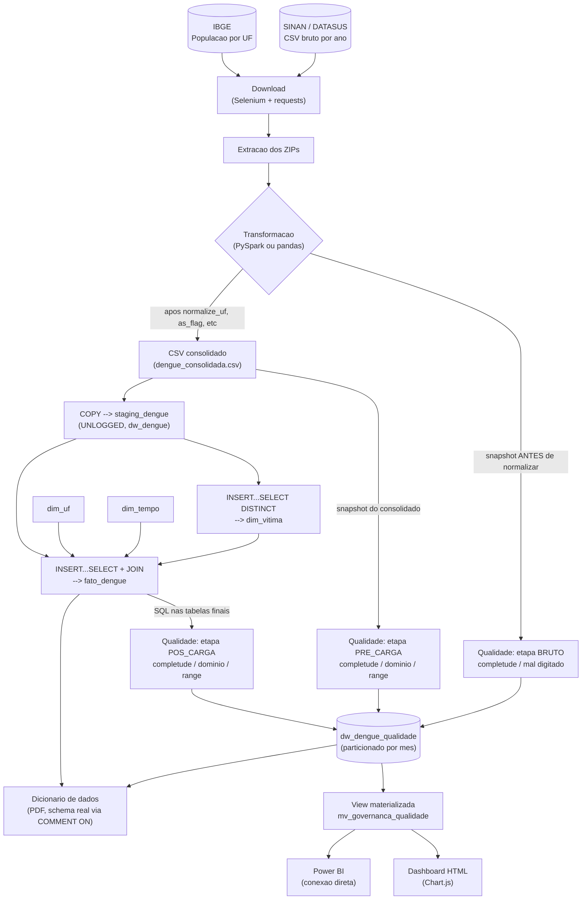
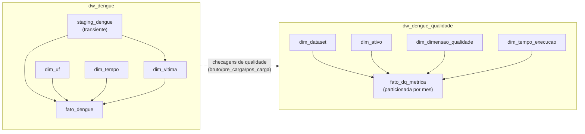

# Arquitetura e Linhagem de Dados -- dengue_warehouse

Gerado automaticamente em 14/08/2026 16:22.

## Fluxo ponta a ponta

## Bancos e responsabilidades

## Legenda de etapas de qualidade

| Etapa | Quando roda | O que mede |
|---|---|---|
| `bruto` | Antes de qualquer normalizacao | Qualidade real do dado como sai do SINAN |
| `pre_carga` | Depois da limpeza (Spark/pandas), antes do DW | Efeito da transformacao na qualidade |
| `pos_carga` | Depois de carregado em `dw_dengue` | Fidelidade do processo de carga (staging + JOIN) |
