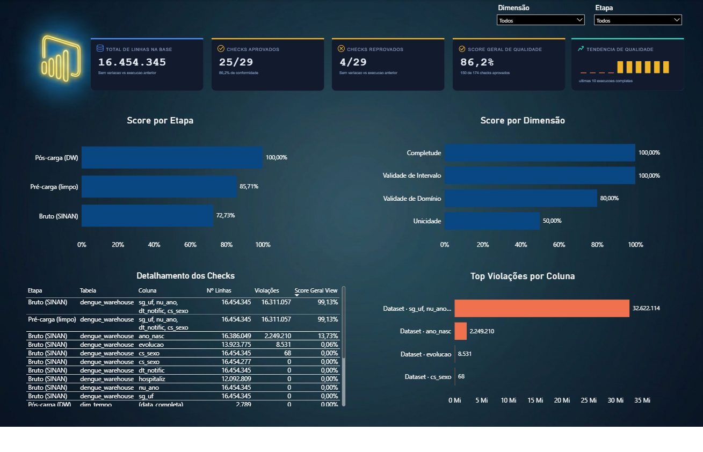

# Dengue Warehouse & Governança de Qualidade de Dados

Pipeline de dados ponta a ponta que baixa, trata, carrega e **audita a
própria qualidade** de dois datasets públicos reais — as notificações
de dengue do **SINAN/DATASUS** e as estimativas populacionais do
**IBGE** — cruzando as duas fontes para gerar métricas que nenhuma
delas sozinha responde, como casos por 100 mil habitantes por UF.

O projeto nasceu de uma pergunta simples: a maioria dos pipelines de
BI carrega dado, mas poucos **provam** que esse dado é confiável. Aqui,
cada execução gera automaticamente seu próprio dicionário de dados,
diagrama de arquitetura e relatório de qualidade — sem trabalho manual
depois que o pipeline termina.

## Sumário

- [Arquitetura](#arquitetura)
- [Stack técnica](#stack-técnica)
- [Framework de qualidade](#framework-de-qualidade)
- [Estrutura do repositório](#estrutura-do-repositório)
- [Como rodar](#como-rodar)
- [Dashboard](#dashboard)
- [Decisões técnicas relevantes](#decisões-técnicas-relevantes)
- [Limitações conhecidas](#limitações-conhecidas)
- [Autor](#autor)

## Arquitetura


O fluxo segue 8 etapas, de fonte bruta a entrega final:

1. **Extração** — download do SINAN (via `requests`) e do IBGE (via
   Selenium, já que o link muda de local periodicamente)
2. **Transformação** — PySpark, com fallback para pandas se o Spark
   não estiver disponível no ambiente
3. **Qualidade (bruto → pré-carga)** — checagens de completude,
   domínio, unicidade e "mal digitado" rodadas antes e depois da
   normalização
4. **Staging (ELT)** — `COPY` do consolidado para uma tabela
   `UNLOGGED`, com datas já como `DATE` nativo (não texto)
5. **Carga dimensional e fato** — resolução de chaves via `JOIN` em
   SQL, com hash join forçado para o volume de dados envolvido
6. **Qualidade (pós-carga)** — checagens direto nas tabelas finais do
   Data Warehouse
7. **Governança** — todas as métricas de qualidade são persistidas em
   um Data Warehouse de governança dedicado, modelado em esquema
   estrela e particionado por mês
8. **Entrega** — dashboard Power BI, dicionário de dados em PDF,
   diagrama de arquitetura e documentação de código gerados
   automaticamente

## Stack técnica

| Camada | Ferramenta |
|---|---|
| Processamento distribuído | PySpark |
| Banco de dados | PostgreSQL (dois bancos: domínio e governança) |
| Extração web | Selenium + `requests` |
| Documentação | ReportLab (PDF), `pdoc` (docs de código), Matplotlib (diagrama) |
| Resumo executivo (opcional) | Gemini API |
| Visualização | Power BI |

## Framework de qualidade

A base teórica é o **DAMA-DMBOK**, aplicado em 3 estágios ao longo do
pipeline — não só no dado final:

| Etapa | Quando roda | O que mede |
|---|---|---|
| `bruto` | Antes de qualquer normalização | Qualidade real do dado como sai do SINAN |
| `pre_carga` | Depois da limpeza (Spark/pandas), antes do DW | Efeito da transformação na qualidade |
| `pos_carga` | Depois de carregado no `dw_dengue` | Fidelidade do processo de carga |

Quatro dimensões de qualidade são checadas em cada estágio:
**completude**, **unicidade**, **validade de domínio** e **validade de
intervalo**. Cada checagem gera uma linha na fato de governança
(`fato_dq_metrica`), com taxa de conformidade, quantidade de
violações e exemplos de valores inválidos.

**Resultado medido**: o SINAN chega com **72,7%** de conformidade nas
checagens de dado bruto — as tabelas finais do Data Warehouse chegam
a **100%** nos checks que rodam sobre elas.

## Estrutura do repositório

```
.
├── src/
│   └── pipeline_dengue_governanca.py   # script principal
├── sql/
│   ├── dw_dengue_ddl.sql                # DDL do DW de dominio
│   ├── governanca_ddl.sql               # DDL do DW de governanca
│   └── queries_analiticas.sql           # queries de apoio ao dashboard
├── docs/
│   ├── arquitetura_pipeline.png         # diagrama gerado automaticamente
│   ├── dicionario_dados.pdf             # dicionario gerado automaticamente
│   └── dashboard/                       # prints do Power BI
├── requirements.txt
└── README.md
```

## Como rodar

### Pré-requisitos

- PostgreSQL 14+
- Java + `JAVA_HOME` configurado (exigido pelo PySpark)
- Google Chrome instalado (usado pelo Selenium)
- Hadoop local no Windows (`winutils.exe`), se for rodar PySpark nesse
  SO

### Instalação

```bash
pip install -r requirements.txt
```

### Variáveis de ambiente

```bash
set DB_DENGUE_PASSWORD=sua_senha
set DB_GOVERNANCA_PASSWORD=sua_senha
set GEMINI_API_KEY=sua_chave        # opcional, so se GENERATE_AI_SUMMARY=True
```

### Banco de dados

```sql
CREATE DATABASE dw_dengue;
CREATE DATABASE dw_dengue_qualidade;
```

Roda `sql/dw_dengue_ddl.sql` e `sql/governanca_ddl.sql` nos bancos
correspondentes (ou deixa o próprio pipeline criar o schema de
governança automaticamente na primeira execução).

### Execução

```python
from pipeline_dengue_governanca import run_pipeline
run_pipeline()
```

## Dashboard

O dashboard Power BI conecta na view materializada
`mv_governanca_qualidade` e mostra:

- Score geral de qualidade, com variação em relação à execução
  anterior
- Evolução da qualidade por etapa (bruto → pré-carga → pós-carga)
- Score por dimensão de qualidade
- Top 5 maiores concentrações de violações
- Tendência de qualidade nas últimas execuções



## Decisões técnicas relevantes

- **ELT em vez de ETL puro** — o consolidado é carregado via `COPY`
  numa tabela de staging, e a resolução de chaves dimensionais
  acontece via `JOIN` em SQL, não em loop Python. Para 16,4M de
  linhas, isso reduziu a carga do fato de horas para ~5 minutos.
- **Hash join forçado** — o Postgres escolhia `Nested Loop` por causa
  de um cast implícito de tipo entre colunas; `enable_nestloop=off`
  força `Hash Join`, adequado dado o tamanho pequeno das dimensões.
- **Índices e PK derrubados antes da carga em massa** — reconstruídos
  do zero ao final, seguindo a recomendação oficial do Postgres para
  cargas grandes.
- **`fato_dengue` é particionada por ano** — descoberto durante o
  desenvolvimento; parâmetros de armazenamento (como
  `autovacuum_enabled`) precisam ser aplicados por partição, não na
  tabela-mãe.
- **Datas como `DATE` nativo na staging**, não texto — elimina
  `TO_DATE()` por linha na hora do `JOIN` com a dimensão de tempo.

## Limitações conhecidas

- A checagem de **unicidade** sobre `(sg_uf, nu_ano, dt_notific,
  cs_sexo)` produz falso positivo em escala: a cardinalidade dessa
  chave é insuficiente para um dataset de 16,4M de linhas, então
  praticamente toda linha aparece como "duplicata". A correção
  planejada é usar `NU_NOTIFIC` (identificador do SINAN) ou a linha
  inteira como chave de unicidade.
- Classificação de sensibilidade de dados (LGPD) e política de
  expurgo de partições antigas ainda não foram implementadas.

## Autor

**Lucca Carnaúba Peixoto Rosário** — Analista de BI, mestrando em Informática (Análise, Gerência e Qualidade de Dados em Larga Escala) - Universidade Federal de Alagoas - UFAL.

Projeto desenvolvido como peça de portfólio, com foco em
demonstrar competências de Analytics Engineering / Data Engineering
complementares ao trabalho de BI Analyst.
